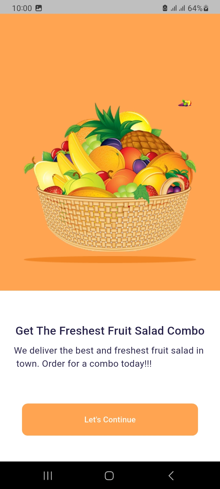
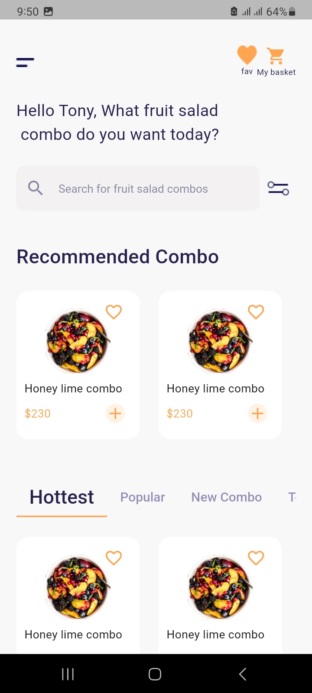
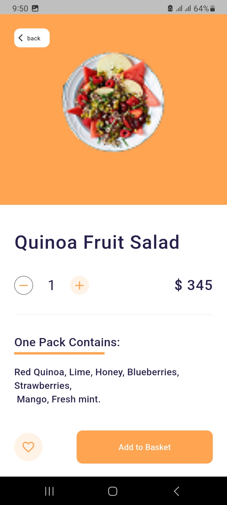
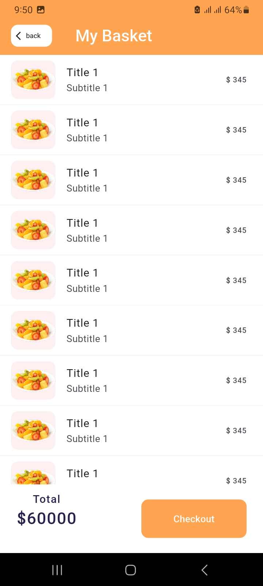
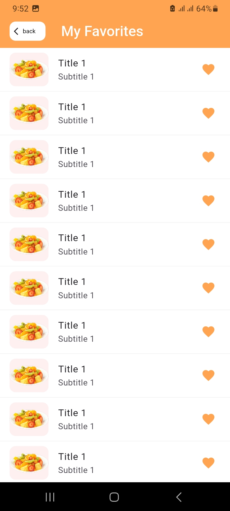
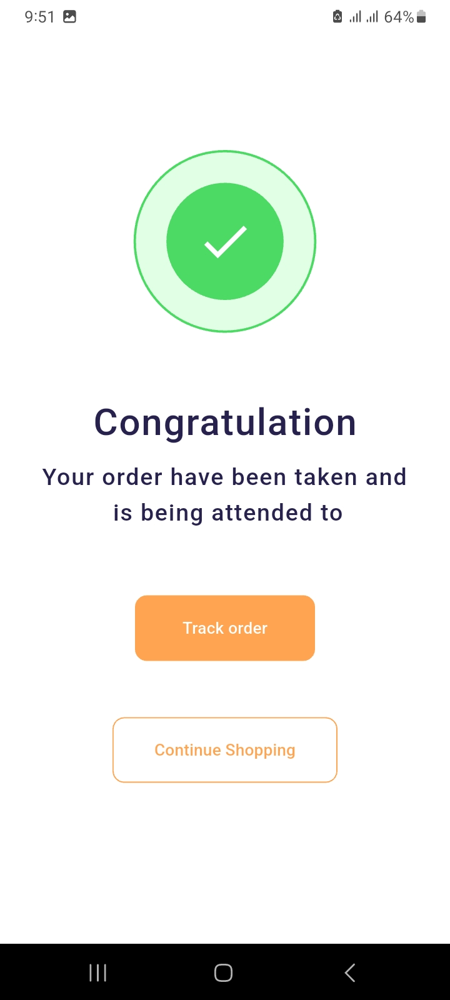

# 🍽️ Food E-Commerce App (Flutter)

A complete **Food E-Commerce mobile application** built with **Flutter**, featuring two distinct versions:
- 🎨 **UI Version (ui branch)** — pure Flutter design based on Figma layout  
- ⚙️ **Functional Version (main branch)** — full app with Provider state management and free REST API integration  

---

## 🚀 Overview

This project is designed to showcase both **beautiful UI design** and **real-world app functionality** in Flutter.  
It provides a smooth and user-friendly experience for browsing, viewing, and managing food items.

---

## 🧭 Branch Information

| Branch | Description |
|--------|--------------|
| `ui` | Contains all static UI screens, animations, and navigation — no backend or API. |
| `main` | Contains the complete functional version — Provider state management + Free API integration. |

---

## 🎨 UI Version Features (UI Branch)

The **UI branch** demonstrates a clean and modern design inspired by a food marketplace.

| Screen | Description |
|--------|--------------|
| **Splash Screen** | App logo animation with a simple loading sequence. |
| **User Name / Welcome Screen** | Lets users enter their name or continue as a guest. |
| **Home Dashboard** | Displays categories, featured items, and recommended foods in tabs. |
| **Food Category Screen** | Organized list of foods with images, names, and prices. |
| **Food Details Screen** | Full food preview with image, price, ingredients, and “Add to Cart” button. |
| **Cart Screen** | Shows selected food items with quantity and total price. |
| **Favorites Screen** | Displays favorite foods added by the user. |
| **Profile Screen** | Contains user information and settings. |
| **Search Screen** | Beautiful search bar UI for food items. |
| **Order Tracking Screen** | Static timeline-style design to show order progress. |

---

### 🖼️ UI Screenshots

You can add your screenshots here once uploaded to GitHub:  

| Screen | Preview |
|--------|----------|
| Splash Screen | ![Splash]
(assets/screenshots/splash _screen.jpg) |
| Welcome Screen |  |
| Home Screen |  |
| Food Details |  |
| Cart |  |
| Favorites |  |
| OrderComplete |  |

> 📌 Tip: Replace the paths above with your actual GitHub **raw image URLs**  
> Example:  
> `https://raw.githubusercontent.com/yourusername/food_ecommerce_app/main/assets/screenshots/home_screen.png`

---

## ⚙️ Functional Version (Main Branch)

The **main branch** adds real functionality to the UI version using **Provider** and **Free REST API**.

### 🔧 Functional Features
✅ Fetch food data dynamically from a public API  
✅ Manage cart (add/remove/update quantity)  
✅ Add or remove favorites  
✅ Search and filter items  
✅ Calculate total price automatically  
✅ Display item details dynamically  
✅ Provider for reactive state management  
✅ Local storage (future scope)  
✅ API error handling and loading states  

---

## 🧠 State Management (Provider)

Provider is used for efficient and reactive state updates.

| Provider | Responsibility |
|-----------|----------------|
| `FoodProvider` | Fetch and store food data from API |
| `CartProvider` | Manage cart items, quantity, and total price |
| `FavoriteProvider` | Manage favorite list |
| `ThemeProvider` | (Optional) Manage light and dark mode |

---

## 📦 Project Structure

